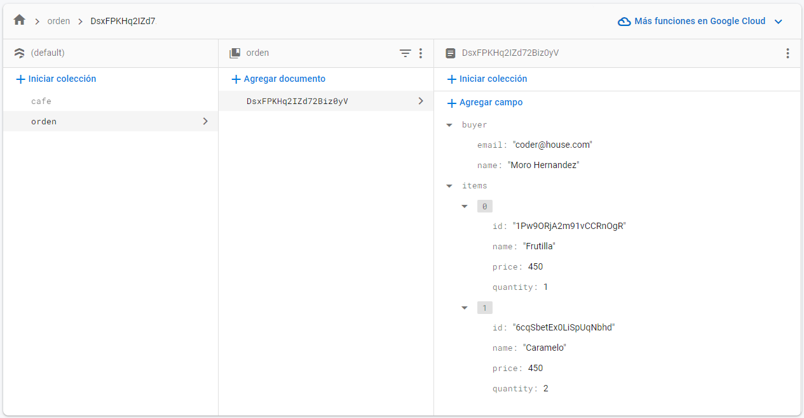

# React + Vite + TailWindCSS 

Hi, I decided to set up a shopping cart system with ReactJS. 

I also use:

- [@vitejs/plugin-react](https://github.com/vitejs/vite-plugin-react/blob/main/packages/plugin-react/README.md) uses [Babel](https://babeljs.io/) for Fast Refresh
- [@vitejs/plugin-react-swc](https://github.com/vitejs/vite-plugin-react-swc) uses [SWC](https://swc.rs/) for Fast Refresh
- [@react-dom]
- [@react-icons]
- [@material-tailwind/react] 
- [@react-router-dom]
- [@tw-elements]  

I used a Firestore Database to store the data and simulate a purchase order: 

I leave you a gif of how a purchase order would be carried out:

    
I hope you like it!    
    